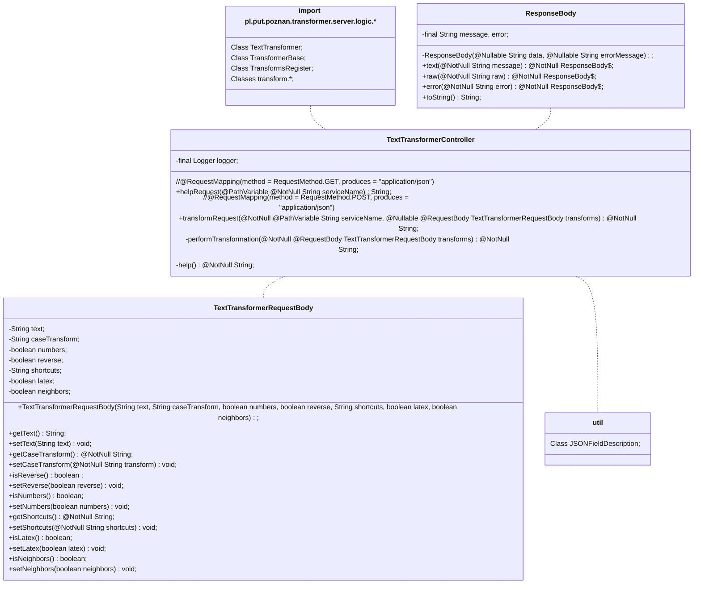

### Diagram Logiki Serwera -pl.put.poznan.transformer.server.logic

```mermaid
classDiagram
  class TextTransformer{
    #String text;
    +getText() @NotNull String;
    +transform() @NotNull String*;
  }
  click TextTransformer href "https://github.com/RubyNaxela/softeng/blob/main/Server/src/main/java/pl/put/poznan/transformer/server/logic/TextTransformer.java"
  class TextTransformerDecorator["TextTransformerDecorator : TextTransformer"] {
    #TextTransformer textToTransform;
    +TextTransformerDecorator(@NotNull TextTransformer textToTransform);
    +description() @NotNull String*;
  }
  click TextTransformerDecorator href "https://github.com/RubyNaxela/softeng/blob/main/Server/src/main/java/pl/put/poznan/transformer/server/logic/TextTransformerDecorator.java"
  class CaseTransform["transform.CaseTransform : TextTransformerDecorator"] {
    -final Type typeOfTransform;
    +CaseTransform(@NotNull TextTransformer textToTransform, @NotNull Type typeOfTransform);
    +transform() @NotNull String;
    +description() @NotNull String; 
    -caseTransformation(@NotNull String text) @NotNull String;
    +enum Type;
  }
  click CaseTransform href "https://github.com/RubyNaxela/softeng/blob/main/Server/src/main/java/pl/put/poznan/transformer/server/logic/transform/CaseTransform.java"
class Enum["+ enum Type"]{
    +fromName(@NotNull String name) Type$;
    <<enumeration>>
    UPPER
    LOWER
    CAPITALIZE
    SENTENCE_CAPITALIZE
    IDENTITY
}
class DuplicatesRemovalTransform["transform.DuplicatesRemovalTransform : TextTransformerDecorator"] {
  -final boolean removeAllow;
  +DuplicatesRemovalTransform(@NotNull TextTransformer textToTransform, boolean removingAllowed);
  +transform() @NotNull String;
  +description() @NotNull String;
  -removeAdjacentDuplicates(@NotNull String input) @NotNull String;
}
click DuplicatesRemovalTransform href "https://github.com/RubyNaxela/softeng/blob/main/Server/src/main/java/pl/put/poznan/transformer/server/logic/transform/DuplicatesRemovalTransform.java"
class LaTeXEscapesTransform["transform.LaTeXEscapesTransform : TextTransformerDecorator"]{
  -static final Map<Character, String> latexCharacterMappings;
  -final boolean latexCharactersAllowed;
  +LaTeXEscapesTransform(@NotNull TextTransformer textToTransform, boolean latexCharactersAllowed);
  +transform() @NotNull String;
  +description() @NotNull String;
  -addLaTeXEscapes() @NotNull String;
}
click LaTeXEscapesTransform href "https://github.com/RubyNaxela/softeng/blob/main/Server/src/main/java/pl/put/poznan/transformer/server/logic/transform/LaTeXEscapesTransform.java"
class NumberExpansionTransform["NumberExpansionTransform : TextTransformerDecorator"]{
  -final Map<Integer, String> DIGITS$;
  -final Map<Integer, String> TEENS$;
  -final Map<Integer, String> TENS$;
  -final Map<Integer, String> HUNDREDS$;
  -final PluralVariant thousands$;
  -final PluralVariant millions$;
  -final PluralVariant billions$;
  -final PluralVariant trillions$;
  -final PluralVariant quadrillions$;
  -final PluralVariant quintillions$;
  -final boolean numberExpandAllowed;
  +NumberExpansionTransform(@NotNull TextTransformer textToTransform, boolean numberExpandAllowed);
  -numberInWords(long number) @NotNull String$;
  +transform() @NotNull String;
  +description() @NotNull String;
  -expandNumbers(@NotNull String s) @NotNull String;
}
click NumberExpansionTransform href "https://github.com/RubyNaxela/softeng/blob/main/Server/src/main/java/pl/put/poznan/transformer/server/logic/transform/NumberExpansionTransform.java"
class ReverseTransform["ReverseTransform : TextTransformerDecorator"]{
  -final boolean inverseAllow;
  +ReverseTransform(@NotNull TextTransformer textToTransform, boolean reversalAllowed);
  +transform() @NotNull String;
  +description() @NotNull String;
  -revertString(@NotNull String input) @NotNull String;
}
click ReverseTransform href "https://github.com/RubyNaxela/softeng/blob/main/Server/src/main/java/pl/put/poznan/transformer/server/logic/transform/ReverseTransform.java"
class ShortcutTransform["ShortcutTransform : TextTransformerDecorator"]{
  -final Type shortcutType;
  -final Map<String, String> shortcutMap;
  +ShortcutTransform(@NotNull TextTransformer textToTransform, @NotNull Type shortcutType);
  -Map<String, String> initializeShortcutMap();
  +transform() @NotNull String;
  +description() @NotNull String;
  +applyShortcutModification(@NotNull String inputText) @NotNull String;
  +enum Type;
}
click ShortcutTransform href "https://github.com/RubyNaxela/softeng/blob/main/Server/src/main/java/pl/put/poznan/transformer/server/logic/transform/ShortcutTransform.java"
class Enum1["+ enum Type"]{
    +fromName(@NotNull String name) Type$;
    <<enumeration>>
    EXPAND
    COMPRESS
    IDENTITY
}
class TransformerBase["TransformerBase : TextTransformer"]{
    +TransformerBase(@NotNull String str);
    +transform() @NotNull String;
}
click TransformerBase href "https://github.com/RubyNaxela/softeng/blob/main/Server/src/main/java/pl/put/poznan/transformer/server/logic/TransformerBase.java"
class TransformsRegister {
    -List<TextTransformerDecorator> final transforms$;
    +register(@NotNull TextTransformerDecorator transform) void$;
    +getTransforms() @NotNull @UnmodifiableView List<TextTransformerDecorator>$;
}
click TransformsRegister href "https://github.com/RubyNaxela/softeng/blob/main/Server/src/main/java/pl/put/poznan/transformer/server/logic/TransformsRegister.java"
 class util{
        Class JSONFieldDescription;
        Class DictionaryBuilder;
        Interface PluralVariant;
        Class PolishPluralVariant;
    }
 click util href "https://github.com/RubyNaxela/softeng/blob/main/Server/src/main/java/pl/put/poznan/transformer/server/util"
  TransformsRegister "1" --> "*" TextTransformerDecorator
  ShortcutTransform .. Enum1
  TextTransformer <|-- TransformerBase
  TextTransformerDecorator <|-- ShortcutTransform
  TextTransformerDecorator <|-- ReverseTransform
  TextTransformerDecorator <|-- NumberExpansionTransform
  TextTransformerDecorator <|-- LaTeXEscapesTransform
  TextTransformerDecorator <|-- DuplicatesRemovalTransform
  CaseTransform .. Enum
  TextTransformer <|-- TextTransformerDecorator
  TextTransformerDecorator <|-- CaseTransform
  TextTransformerDecorator .. util : JSONFieldDescription
  CaseTransform .. util : JSONFieldDescription
  DuplicatesRemovalTransform .. util : JSONFieldDescription
  LaTeXEscapesTransform .. util : JSONFieldDescription
  NumberExpansionTransform .. util : all
  ReverseTransform .. util : JSONFieldDescription
  ShortcutTransform .. util : JSONFieldDescription
```
### Diagram Klas Rest dla Serwera -pl.put.poznan.transformer.server.rest

```mermaid
classDiagram
    class ResponseBody {
        -final String message, error;
        -ResponseBody(@Nullable String data, @Nullable String errorMessage);
        +text(@NotNull String message) @NotNull ResponseBody$;
        +raw(@NotNull String raw) @NotNull ResponseBody$;
        +error(@NotNull String error) @NotNull ResponseBody$;
        +toString() String;
    }
    click ResponseBody href "https://github.com/RubyNaxela/softeng/blob/main/Server/src/main/java/pl/put/poznan/transformer/server/rest/ResponseBody.java"
    class TextTransformerController{
        -final Logger logger;
        //@RequestMapping(method = RequestMethod.GET, produces = "application/json")
        +helpRequest(@PathVariable @NotNull String serviceName) String;
        //@RequestMapping(method = RequestMethod.POST, produces = "application/json")
        +transformRequest(@NotNull @PathVariable String serviceName, @Nullable @RequestBody TextTransformerRequestBody transforms) @NotNull String;
        -performTransformation(@NotNull @RequestBody TextTransformerRequestBody transforms) @NotNull String;
        -help() @NotNull String;
    }
    click TextTransformerController href "https://github.com/RubyNaxela/softeng/blob/main/Server/src/main/java/pl/put/poznan/transformer/server/rest/TextTransformerController.java"
    class logic["import pl.put.poznan.transformer.server.logic.*"]{
        Class TextTransformer;
        Class TransformerBase;
        Class TransformsRegister;
        Classes transform.*;
    }
    click logic href "https://github.com/RubyNaxela/softeng/blob/main/Server/src/main/java/pl/put/poznan/transformer/server/logic"
    class util{
        Class JSONFieldDescription;
    }
    click util href "https://github.com/RubyNaxela/softeng/blob/main/Server/src/main/java/pl/put/poznan/transformer/server/util/JSONFieldDescription.java"
    class TextTransformerRequestBody{
        -String text;
        -String caseTransform;
        -boolean numbers;
        -boolean reverse;
        -String shortcuts;
        -boolean latex;
        -boolean neighbors;
        +TextTransformerRequestBody(String text, String caseTransform, boolean numbers, boolean reverse, String shortcuts, boolean latex, boolean neighbors);
        +getText() String;
        +setText(String text) void;
        +getCaseTransform() @NotNull String;
        +setCaseTransform(@NotNull String transform) void;
        +isReverse() boolean ;
        +setReverse(boolean reverse) void;
        +isNumbers() boolean;
        +setNumbers(boolean numbers) void;
        +getShortcuts() @NotNull String;
        +setShortcuts(@NotNull String shortcuts) void;
        +isLatex() boolean;
        +setLatex(boolean latex) void;
        +isNeighbors() boolean;
        +setNeighbors(boolean neighbors) void;
    }
    click TextTransformerRequestBody href "https://github.com/RubyNaxela/softeng/blob/main/Server/src/main/java/pl/put/poznan/transformer/server/rest/TextTransformerRequestBody.java"
      TextTransformerController .. TextTransformerRequestBody
      TextTransformerController .. util
      logic .. TextTransformerController
      ResponseBody .. TextTransformerController
```
