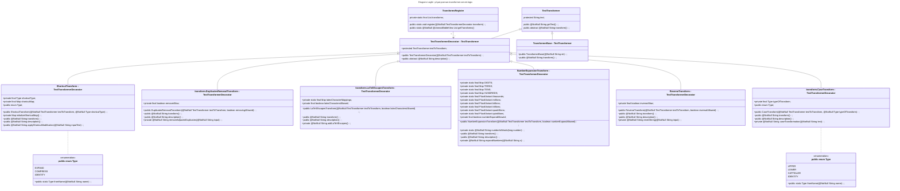

```mermaid
---
title: Diagram Logiki -pl.put.poznan.transformer.server.logic
---
classDiagram
  class TextTransformer{
    protected String text;
    public @NotNull String getText();
    public abstract @NotNull String transform();
  }
  click TextTransformer href "https://github.com/RubyNaxela/softeng/blob/main/Server/src/main/java/pl/put/poznan/transformer/server/logic/TextTransformer.java"
  class TextTransformerDecorator["TextTransformerDecorator : TextTransformer"] {
    +protected TextTransformer textToTransform;
    +public TextTransformerDecorator(@NotNull TextTransformer textToTransform);
    +public abstract @NotNull String description();
  }
  click TextTransformerDecorator href "https://github.com/RubyNaxela/softeng/blob/main/Server/src/main/java/pl/put/poznan/transformer/server/logic/TextTransformerDecorator.java"
  class CaseTransform["transform.CaseTransform : TextTransformerDecorator"] {
    +private final Type typeOfTransform;
    +public CaseTransform(@NotNull TextTransformer textToTransform, @NotNull Type typeOfTransform);
    ~public @NotNull String transform();
    ~public @NotNull String description(); 
    +private @NotNull String caseTransformation(@NotNull String text);
    +public enum Type;
  }
  click CaseTransform href "https://github.com/RubyNaxela/softeng/blob/main/Server/src/main/java/pl/put/poznan/transformer/server/logic/transform/CaseTransform.java"
class Enum["public enum Type"]{
    +public static Type fromName(@NotNull String name);
    <<enumeration>>
    UPPER
    LOWER
    CAPITALIZE
    IDENTITY
}
class DuplicatesRemovalTransform["transform.DuplicatesRemovalTransform : TextTransformerDecorator"] {
  +private final boolean removeAllow;
  +public DuplicatesRemovalTransform(@NotNull TextTransformer textToTransform, boolean removingAllowed);
  ~public @NotNull String transform();
  ~public @NotNull String description();
  +private @NotNull String removeAdjacentDuplicates(@NotNull String input);
}
click DuplicatesRemovalTransform href "https://github.com/RubyNaxela/softeng/blob/main/Server/src/main/java/pl/put/poznan/transformer/server/logic/transform/DuplicatesRemovalTransform.java"
class LaTeXEscapesTransform["transform.LaTeXEscapesTransform : TextTransformerDecorator"]{
  +private static final Map<Character, String> latexCharacterMappings;
  +private final boolean latexCharactersAllowed;
  +public LaTeXEscapesTransform(@NotNull TextTransformer textToTransform, boolean latexCharactersAllowed);
  ~public @NotNull String transform();
  ~public @NotNull String description();
  +private @NotNull String addLaTeXEscapes();
}
click LaTeXEscapesTransform href "https://github.com/RubyNaxela/softeng/blob/main/Server/src/main/java/pl/put/poznan/transformer/server/logic/transform/LaTeXEscapesTransform.java"
class NumberExpansionTransform["NumberExpansionTransform : TextTransformerDecorator"]{
  +private static final Map<Integer, String> DIGITS;
  +private static final Map<Integer, String> TEENS;
  +private static final Map<Integer, String> TENS;
  +private static final Map<Integer, String> HUNDREDS;
  +private static final PluralVariant thousands;
  +private static final PluralVariant millions;
  +private static final PluralVariant billions;
  +private static final PluralVariant trillions;
  +private static final PluralVariant quadrillions;
  +private static final PluralVariant quintillions;
  +private final boolean numberExpandAllowed;
  +public NumberExpansionTransform(@NotNull TextTransformer textToTransform, boolean numberExpandAllowed);
  +private static @NotNull String numberInWords(long number);
  ~public @NotNull String transform();
  ~public @NotNull String description();
  +private @NotNull String expandNumbers(@NotNull String s);
}
click NumberExpansionTransform href "https://github.com/RubyNaxela/softeng/blob/main/Server/src/main/java/pl/put/poznan/transformer/server/logic/transform/NumberExpansionTransform.java"
class ReverseTransform["ReverseTransform : TextTransformerDecorator"]{
  +private final boolean inverseAllow;
  +public ReverseTransform(@NotNull TextTransformer textToTransform, boolean reversalAllowed);
  ~public @NotNull String transform();
  ~public @NotNull String description();
  +private @NotNull String revertString(@NotNull String input);
}
click ReverseTransform href "https://github.com/RubyNaxela/softeng/blob/main/Server/src/main/java/pl/put/poznan/transformer/server/logic/transform/ReverseTransform.java"
class ShortcutTransform["ShortcutTransform : TextTransformerDecorator"]{
  +private final Type shortcutType;
  +private final Map<String, String> shortcutMap;
  +public ShortcutTransform(@NotNull TextTransformer textToTransform, @NotNull Type shortcutType);
  +private Map<String, String> initializeShortcutMap();
  ~public @NotNull String transform();
  ~public @NotNull String description();
  +public @NotNull String applyShortcutModification(@NotNull String inputText);
  +public enum Type;
}
click ShortcutTransform href "https://github.com/RubyNaxela/softeng/blob/main/Server/src/main/java/pl/put/poznan/transformer/server/logic/transform/ShortcutTransform.java"
class Enum1["public enum Type"]{
    +public static Type fromName(@NotNull String name);
    <<enumeration>>
    EXPAND
    COMPRESS
    IDENTITY
}
class TransformerBase["TransformerBase : TextTransformer"]{
    +public TransformerBase(@NotNull String str);
    ~public @NotNull String transform();
}
click TransformerBase href "https://github.com/RubyNaxela/softeng/blob/main/Server/src/main/java/pl/put/poznan/transformer/server/logic/TransformerBase.java"
class TransformsRegister {
    private static final List<TextTransformerDecorator> transforms;
    public static void register(@NotNull TextTransformerDecorator transform);
    public static @NotNull @UnmodifiableView List<TextTransformerDecorator> getTransforms()
}
click TransformsRegister href "https://github.com/RubyNaxela/softeng/blob/main/Server/src/main/java/pl/put/poznan/transformer/server/logic/TransformsRegister.java"
  TransformsRegister "1" --> "*" TextTransformerDecorator
  ShortcutTransform .. Enum1
  TextTransformer <|-- TransformerBase
  TextTransformerDecorator <|-- ShortcutTransform
  TextTransformerDecorator <|-- ReverseTransform
  TextTransformerDecorator <|-- NumberExpansionTransform
  TextTransformerDecorator <|-- LaTeXEscapesTransform
  TextTransformerDecorator <|-- DuplicatesRemovalTransform
  CaseTransform .. Enum
  TextTransformer <|-- TextTransformerDecorator
  TextTransformerDecorator <|-- CaseTransform
```
